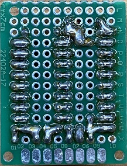

## SBUS-Switch  
siehe auch Doku [SBUS-Switch V2.4.pdf](Docs/SBUS-Switch%20V2.4.pdf)  
• Schaltmodul für RC-Modellbau mit 8 Schaltausgängen  
• optimiert für OpenTX und EdgeTX Sender  
• Anschluss via SBUS  
• alle 8 Ausgänge über einen einzigen Kanal steuerbar oder  
• jeder Ausgang über seperaten Kanal steuerbar  
• verschiedene Treiberstufen möglich (Plus- oder Minuspol geschaltet)  
• einfache Hardware  
• beliebig kaskadierbar (limitiert durch max Anzahl Kanäle oder Mischer des Senders)  
• 2 Ausgänge dimmbar (PWM 15Hz - 16kHz) Dimmfunktion wahlweise aktivierbar  

Support Forum:
https://www.rc-network.de/threads/sbus-switch.696022/

 

### SBUS-Switch-Mini  
Es gibt eine kleinere Variante auf Basis ATTiny85
https://github.com/Tiefflieger68/SBUS-Switch/tree/main/SBUS-Switch-Mini  

## English:  
For now all documents are written in German. I will support English requests as well  
• Switch Module for RC Models with 8 switched outputs  
• optimized for OpenTX and EdgeTX Radios  
• connected by SBUS  
• All 8 outputs can be controlled by one single channel. Or  
• every output can be controlled by a seperate channel  
• different power drivers possible  
• easy hardware  
• unlimited stackable (limit is the max number of channels and mixers of the radio)  
• 2 outputs are dimmable (PWM 15Hz - 16kHz)  

