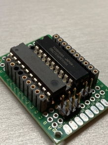

## SBUS-Switch  
siehe auch ausführliche Dokumentation [SBUS-Switch V2.4.x.pdf](docs)  
• Schaltmodul für RC-Modellbau mit 8 Schaltausgängen  
• optimiert für OpenTX und EdgeTX Sender  
• Anschluss via SBUS  
• alle 8 Ausgänge über einen einzigen Kanal steuerbar oder  
• jeder Ausgang über seperaten Kanal steuerbar  
• verschiedene Treiberstufen möglich (Plus- oder Minuspol geschaltet)  
• einfache Hardware  
• beliebig kaskadierbar (limitiert durch max Anzahl Kanäle oder Mischer des Senders)  
• 2 Ausgänge dimmbar (PWM 15Hz - 16kHz) Dimmfunktion einzeln aktivierbar  
• Lua Script für Programmierung von openTX/EdgeTX Sender (mit Farbdisplay) - Siehe "LUA Tool Script"  

Support Forum:
https://www.rc-network.de/threads/sbus-switch.696022/

 

### SBUS-Switch-Mini  
Es gibt eine kleinere Variante auf Basis ATTiny85  
https://github.com/Tiefflieger68/SBUS-Switch/tree/main/SBUS-Switch-Mini  

## English:  
For now all [documents](docs) are written in German. Google Translator for the detailed docs should work properly.  
I will support English requests as well.  

Bullet points:
• Switch Module for RC Models with 8 switched outputs  
• optimized for OpenTX and EdgeTX Radios  
• connected by SBUS  
• All 8 outputs can be controlled by one single channel. Or  
• every output can be controlled by a seperate channel  
• different power drivers possible  
• easy hardware  
• unlimited stackable (limit is the max number of channels and mixers of the radio)  
• 2 outputs are dimmable (PWM 15Hz - 16kHz)  
• Lua Script for programmimg of openTX/EdgeTX Radios (color display only) - Find [LUA Tool Script](LUA Tool Script)   

Schaltplan / Schematic:  

